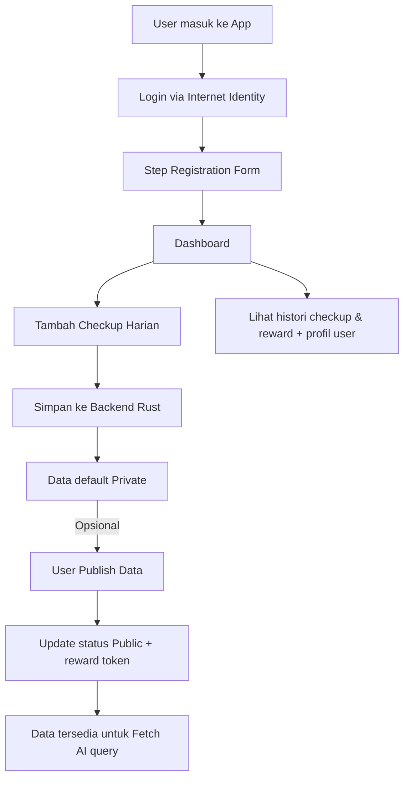

# 🏥 DeHealth Staking dApp on ICP

Dokumentasi teknis project DeFi Staking + Health Data di atas **Internet Computer (ICP)**, dengan integrasi **Fetch AI Agent** dan **ASI1 LLM**.

---

# Product Requirement Document (PRD)

**Nama Project**  
DeHealth Staking dApp on ICP

**Deskripsi**  
Aplikasi Web3 berbasis **ICP** untuk pencatatan kesehatan harian dengan kontrol privasi.

- User login via **Internet Identity**
- Setelah login → user **wajib register** (buat profil di app)
- Input checkup harian (suhu, tekanan darah, mood, catatan, foto opsional)
- Default private → bisa publish ke public untuk dapat reward token
- Data public bisa diakses **Fetch AI agent**, diteruskan ke **ASI1 LLM** untuk analisis
- Data private hanya bisa diakses owner dengan credential

**Fitur Utama**

- Authentication: Internet Identity
- **Step Registration Flow (buat profil user)**
- Health Checkup Input (once/day)
- Dashboard (riwayat checkup, reward balance, profil user)
- Privacy Control (Private/Public)
- Reward Distribution saat publish data
- Integrasi dengan Fetch AI & ASI1

---

# Flow Aplikasi



# Flow User

1. Login dengan Internet Identity

2. Step Registration (isi data profil) → nama lengkap, umur, jenis kelamin, tinggi badan, berat badan, riwayat penyakit, alergi, dll

3. Masuk ke dashboard (profil lengkap + checkup histori)

4. Isi checkup harian → data tersimpan private

5. User bisa publish checkup → dapat reward

6. Fetch AI agent query data public → forward ke ASI1 → summary

# Flow Data


---

# State Database Backend Rust (minimal)

```rust
Type (Rust)

// Representasi User
struct User {
    id: Principal,
    full_name: String,
    age: u32,
    gender: String,        // "Male", "Female", "Other"
    height_cm: Option<f32>,
    weight_kg: Option<f32>,
    allergies: Option<String>,
    chronic_diseases: Option<String>,
    total_rewards: u64,
    health_data: Vec<HealthCheckup>,
}

// Representasi 1 checkup
struct HealthCheckup {
    id: String,
    date: u64,
    data: HealthData,
    is_public: bool,
}

// Isi data kesehatan (lebih lengkap)
struct HealthData {
    temperature: f32,
    blood_pressure: String,
    heart_rate: u32,
    respiration_rate: Option<u32>,
    sleep_hours: Option<f32>,
    mood: String,
    activity_level: Option<String>, // "Low", "Moderate", "High"
    note: String,
    photo_url: Option<String>, // optional hasil capture kamera
}

```

---

# UI Adjustments

**A. Registration Flow (Step UI)**

- Step 1: Nama lengkap + umur + jenis kelamin

- Step 2: Tinggi badan, berat badan

- Step 3: Riwayat penyakit & alergi (optional)

- Step 4: Review & Confirm

➡️**UI jadi multi-step wizard (progress bar di atas, tombol Next/Back).**

**B. Medical Checkup Form**

Input yang disarankan:

- Suhu tubuh (°C)

- Tekanan darah (sistolik/diastolik)

- Detak jantung (BPM)

- Laju pernapasan (opsional)

- Jam tidur (opsional)

- Mood (dropdown: Senang, Sedih, Stres, Normal)

- Aktivitas harian (dropdown: Low/Moderate/High)

- Catatan tambahan (textarea)

- 📷 Ambil foto (opsional) → pakai kamera HP/laptop → diupload ke ICP bucket/IPFS

---

# Backend Minimal function Inteface Implement

```rust
// Register user setelah login Internet Identity
pub fn register_user(
    principal: Principal,
    full_name: String,
    age: u32,
    gender: String,
    height_cm: Option<f32>,
    weight_kg: Option<f32>,
    allergies: Option<String>,
    chronic_diseases: Option<String>,
) -> Result<User, String> { unimplemented!() }

// Ambil profil user
pub fn get_user_profile(principal: Principal) -> Option<User> { unimplemented!() }

// Tambah checkup (default private)
pub fn add_checkup(principal: Principal, data: HealthData) -> Result<HealthCheckup, String> { unimplemented!() }

// Ambil histori checkup user
pub fn get_user_history(principal: Principal) -> Vec<HealthCheckup> { unimplemented!() }

// Publish checkup sekali saja (irreversible)
pub fn publish_checkup(principal: Principal, checkup_id: String) -> Result<(), String> { unimplemented!() }

// Ambil semua data publik (untuk Fetch AI)
pub fn get_public_data() -> Vec<(Principal, HealthCheckup)> { unimplemented!() }

// Ambil data private dengan credential
pub fn get_private_data(principal: Principal, checkup_id: String, name: String) -> Option<HealthCheckup> { unimplemented!() }

// Tambahkan reward ke user
pub fn reward_user(principal: Principal, amount: u64) -> Result<(), String> { unimplemented!() }

// Ambil balance reward user
pub fn get_user_balance(principal: Principal) -> u64 { unimplemented!() }
```
