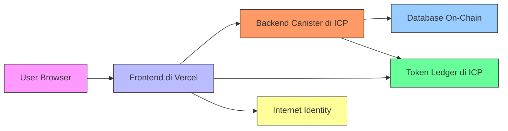

# Deployment Architecture Guide

This document outlines the complete deployment process for the Fetch AI Health application with a hybrid architecture, using Internet Computer for backend and token ledger, and Vercel for frontend.

## Table of Contents

- [Deployment Architecture Guide](#deployment-architecture-guide)
  - [Table of Contents](#table-of-contents)
  - [Architecture Overview](#architecture-overview)
    - [Component Flow](#component-flow)
    - [Communication Flow](#communication-flow)
  - [Components](#components)
  - [Prerequisites](#prerequisites)
    - [ICP Mainnet](#icp-mainnet)
    - [Vercel](#vercel)
    - [Environment Variables](#environment-variables)
  - [Deployment to Internet Computer (Mainnet)](#deployment-to-internet-computer-mainnet)
    - [Backend Canister](#backend-canister)
    - [Token Ledger](#token-ledger)
  - [Deployment to Vercel](#deployment-to-vercel)
    - [Environment Configuration](#environment-configuration)
    - [Frontend Integration](#frontend-integration)
  - [Post-Deployment Verification](#post-deployment-verification)
    - [Backend Canister Tests](#backend-canister-tests)
    - [Token Ledger Verification](#token-ledger-verification)
    - [Frontend Testing](#frontend-testing)
  - [Maintenance and Updates](#maintenance-and-updates)
    - [Backend Updates](#backend-updates)
    - [Frontend Updates](#frontend-updates)
    - [Monitoring](#monitoring)
  - [Troubleshooting](#troubleshooting)
    - [Common Issues](#common-issues)
    - [Contact Support](#contact-support)

## Architecture Overview

The application uses a hybrid deployment model for optimal performance, security, and cost-efficiency:



### Component Flow

1. **User Authentication Flow:**

   ```mermaid
   graph TD
       U[User] --> V[Frontend]
       V -->|Register/Login| W[Internet Identity]
       W -->|Auth Token| X[Frontend]
       X -->|Validate| Y[Backend Canister]
       Y -->|Access Granted| Z[Application]
   ```

2. **Data Publication Flow:**

   ```mermaid
   graph TD
       A1[User] --> B1[Frontend]
       B1 -->|Public Data| C1[Backend Canister]
       C1 -->|Verify| D1[Check Permissions]
       D1 -->|Update| E1[On-Chain Database]
       C1 -->|Transfer Reward| F1[Token Ledger]
       C1 -->|Success| G1[Frontend]
   ```

3. **Token Reward Flow:**
   ```mermaid
   graph TD
       T1[Checkup Published] --> T2[Backend Canister]
       T2 --> T3[Validate Checkup]
       T3 --> T4[Calculate Rewards]
       T4 --> T5{Reward Type}
       T5 -->|$MEDCN Tokens| T6[ICRC-1 Ledger]
       T5 -->|Badge NFT| T7[ICRC-7 Ledger]
       T6 --> T8[Update User Balance]
       T7 --> T8
       T8 --> T9[Frontend Update]
   ```

### Communication Flow

The application follows a secure communication pattern:

1. **Frontend → Backend (HTTPS)**
2. **Backend → Token Ledger (Canister Inter-Call)**
3. **Backend → Database (Direct Storage)**
4. **User → Internet Identity (Authentication)**

## Components

- **Internet Computer**: Hosts backend logic and token ledger (on-chain, secure)
- **Vercel**: Hosts frontend application (fast CDN delivery)
- **Communication Flow**:
  1. Browser → Frontend (Vercel)
  2. Frontend → Backend canister (ICP)
  3. Backend → Token ledger (ICP)
  4. Responses flow back through the same chain

## Prerequisites

### ICP Mainnet

- [x] `dfx` CLI installed (version 0.15.0+)
- [x] Wallet with ICP tokens for canister creation
- [x] Canister ID for backend reserved
- [x] Canister ID for token ledger reserved

### Vercel

- [x] Vercel account
- [x] GitHub/GitLab repository connected to Vercel
- [x] Domain configured (e.g., app.fetchai.health)

### Environment Variables

Prepare the following variables:

```
NEXT_PUBLIC_ICP_GATEWAY=https://icp0.io
NEXT_PUBLIC_BACKEND_CANISTER_ID=<backend_canister_id>
NEXT_PUBLIC_TOKEN_CANISTER_ID=<token_canister_id>
NEXT_PUBLIC_IC_NETWORK=mainnet
```

## Deployment to Internet Computer (Mainnet)

### Backend Canister

1. **Configure network to mainnet:**

```bash
dfx network use ic
```

2. **Deploy backend canister:**

```bash
dfx deploy backend --network ic --with-cycles 2000000000000 --yes
```

3. **Verify deployment:**

```bash
dfx canister --network ic status backend
```

4. **Expected response:**

```
Status: Running
Controllers: <your_principal>
Module hash: <hash>
Memory size: <size>
Cycle balance: <balance>
```

### Token Ledger

1. **Deploy token canister:**

```bash
dfx deploy tokens --network ic --with-cycles 3000000000000 --yes
```

2. **Verify token deployment:**

```bash
dfx canister --network ic status tokens
```

3. **Save the canister ID** for frontend integration

4. **Register with NNS** (optional):
   - Visit https://dashboard.internetcomputer.org
   - Submit canister details for public listing

## Deployment to Vercel

### Environment Configuration

1. **Create `.env.local` file:**

```env
# Deployment environment
NEXT_PUBLIC_IC_NETWORK=mainnet

# ICP Gateways
NEXT_PUBLIC_ICP_GATEWAY=https://icp0.io

# Canister IDs
NEXT_PUBLIC_BACKEND_CANISTER_ID=r7inp-6aaaa-aaaaa-aaabq-cai
NEXT_PUBLIC_TOKEN_CANISTER_ID=s7inp-6aaaa-aaaaa-aaaba-cai

# Application settings
NEXT_PUBLIC_APP_NAME="Fetch AI Health"
NEXT_PUBLIC_APP_VERSION="1.0.0"
NEXT_PUBLIC_APP_ENV="production"
```

2. **Add environment variables to Vercel project:**
   - Go to Vercel dashboard
   - Select your project
   - Click on "Settings" → "Environment Variables"
   - Add all NEXT*PUBLIC*\* variables

### Frontend Integration

1. **Update agent configuration (`src/lib/agent.ts`):**

```typescript
import { HttpAgent } from "@dfinity/agent";

const createAgent = () => {
  const host = process.env.NEXT_PUBLIC_ICP_GATEWAY || "https://icp0.io";
  const agent = new HttpAgent({ host });

  // Only fetch root key in local development
  if (process.env.NEXT_PUBLIC_IC_NETWORK !== "mainnet") {
    agent.fetchRootKey().catch(console.warn);
  }

  return agent;
};

export default createAgent;
```

2. **Configure build process (`package.json`):**

```json
{
  "scripts": {
    "dfx-gen": "cd ic && dfx generate && cd ..",
    "build": "yarn dfx-gen && next build",
    "start": "next start"
  }
}
```

3. **Deploy to Vercel:**

```bash
git add .
git commit -m "Prepare for mainnet deployment"
git push origin main
```

## Post-Deployment Verification

### Backend Canister Tests

Run these verification commands:

1. **Check HTTP endpoint:**

```bash
curl -X POST https://r7inp-6aaaa-aaaaa-aaabq-cai.icp0.io/update_profile_user \
  -H "Content-Type: application/json" \
  -d '{"principal": "<your_principal>", "full_name": "Test User"}'
```

2. **Query user data:**

```bash
dfx canister --network ic call backend get_user_profile '(principal "<your_principal>")'
```

### Token Ledger Verification

1. **Check initial supply:**

```bash
dfx canister --network ic call tokens total_supply
```

2. **Verify metadata:**

```bash
dfx canister --network ic call tokens metadata
```

3. **Check balance:**

```bash
dfx canister --network ic call tokens balance_of '(record { owner = principal "<your_principal>"; subaccount = null })'
```

### Frontend Testing

1. **Access your deployed application**
2. **Test key flows:**
   - User login with Internet Identity
   - Profile edit and save
   - View token balance
   - Public checkup to trigger reward

## Maintenance and Updates

### Backend Updates

1. **Upgrade canister:**

```bash
dfx deploy backend --network ic --mode upgrade
```

2. **Handle state migration:**

```bash
# For pre_upgrade and post_upgrade hooks
dfx canister --network ic call backend pre_upgrade
# Deploy updates
dfx deploy backend --network ic --mode upgrade
# Verify with post_upgrade
dfx canister --network ic call backend post_upgrade
```

### Frontend Updates

1. **Push to main branch:**

```bash
git add .
git commit -m "Feature updates"
git push origin main
```

2. **Monitor Vercel deployment:**
   - Check build logs
   - Verify deployment URL
   - Test application

### Monitoring

1. **ICP Dashboard:** https://dashboard.internetcomputer.org
2. **Vercel Analytics:** https://vercel.com/analytics
3. **Canary testing:** Deploy updates to a test canister first

## Troubleshooting

### Common Issues

| Issue                  | Solution                               |
| ---------------------- | -------------------------------------- |
| "Canister not found"   | Verify canister ID and network         |
| "Unauthorized access"  | Check principal in backend auth guard  |
| "Cycles exhausted"     | Deposit more cycles to canister        |
| "Frontend not loading" | Verify environment variables in Vercel |

### Contact Support

- **ICP Community:** https://forum.dfinity.org
- **Vercel Support:** https://vercel.com/support
