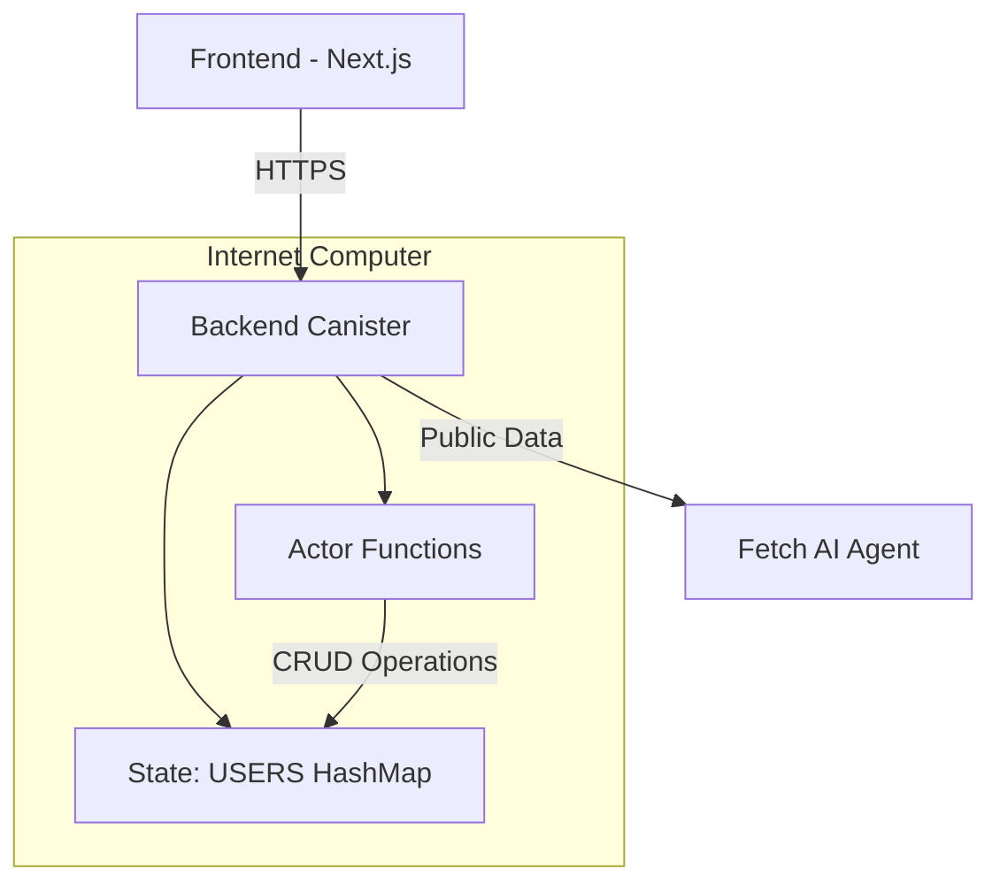
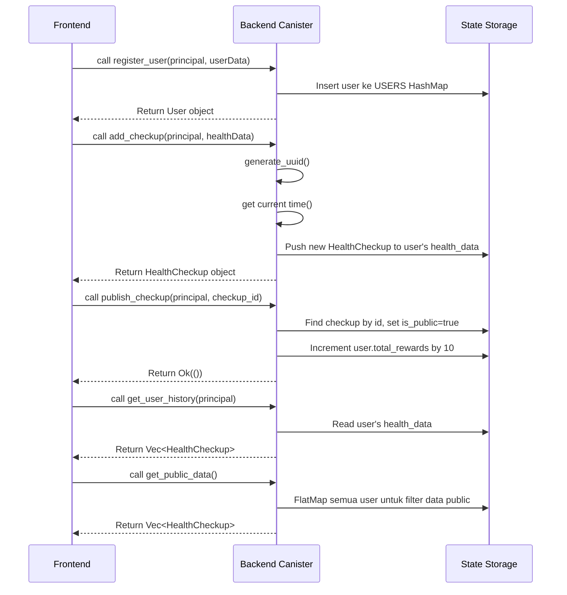

# DEHEALTH Backend Architecture Documentation

## 1. Sistem Informasi
- **Framework**: Internet Computer Protocol (ICP)
- **Bahasa Pemrograman**: Rust
- **Kanister Backend**: `backend`
- **Polanya**: Actor Model dengan Single-Threaded Execution

## 2. Diagram Arsitektur Sistem



## 3. Struktur Actor dan Fungsi Utama

Canister backend bertindak sebagai actor tunggal dengan state global, menyajikan dua jenis fungsi:

### Query Fungsi (ReadOnly)
- `get_user_profile(principal: Principal)`: Mengambil profil pengguna berdasarkan Principal ID
- `get_user_history(principal: Principal)`: Mengambil seluruh histori data kesehatan pengguna
- `get_private_data(principal: Principal)`: Akses data pribadi dengan otorisasi
- `get_public_data()`: Mengambil data terpublikasi dari semua pengguna
- `http_request(req: HttpRequest)`: Titik awal untuk HTTP handshake

### Update Fungsi (State Mutation)
- `register_user(...)`: Pendaftaran pengguna baru
- `add_checkup(principal: Principal, data: HealthData)`: Menambah data pemeriksaan kesehatan
- `publish_checkup(principal: Principal, checkup_id: String)`: Memublikasikan data privat ke publik
- `reward_user(principal: Principal, points: u64)`: Memberi reward poin kepada pengguna
- `http_request_update(req: HttpRequest)`: Routing HTTP POST ke handler spesifik

## 4. Definisi Tipe Data dan State Structure

### State Management
- Menggunakan `thread_local!` untuk menyimpan state persisten:  
```rust
thread_local! {
    static USERS: RefCell<HashMap<Principal, User>> = RefCell::new(HashMap::new());
}
```
- State disimpan dalam memory kanister dan dipertahankan meski eksekusi fungsi selesai
- Tidak menggunakan Storable/Storage framework tradisional, mengandalkan mekanisme persistensi otomatis ICP

### Struktur Data Utama

#### `HealthData` [`ic/src/backend/src/lib.rs:8`](ic/src/backend/src/lib.rs:8)
Data kesehatan harian pengguna, mencakup:
```rust
pub struct HealthData {
    pub temperature: f32,
    pub blood_pressure: String,
    pub heart_rate: u32,
    pub respiration_rate: Option<u32>,
    pub sleep_hours: Option<f32>,
    pub mood: String,
    pub activity_level: Option<String>,
    pub note: String,
    pub photo_url: Option<String>,
}
```

#### `HealthCheckup` [`ic/src/backend/src/lib.rs:22`](ic/src/backend/src/lib.rs:22)
Representasi entitas data pemeriksaan kesehatan:
```rust
pub struct HealthCheckup {
    pub id: String,
    pub date: u64,
    pub data: HealthData,
    pub is_public: bool,
}
```

#### `User` [`ic/src/backend/src/lib.rs:30`](ic/src/backend/src/lib.rs:30)
Profil pengguna dengan data histori:
```rust
pub struct User {
    pub id: Principal,
    pub full_name: String,
    pub age: u32,
    pub gender: String,
    pub height_cm: Option<f32>,
    pub weight_kg: Option<f32>,
    pub allergies: Option<String>,
    pub chronic_diseases: Option<String>,
    pub total_rewards: u64,
    pub health_data: Vec<HealthCheckup>,
}
```

## 5. Implementasi Fungsi Kunci

### `get_user_history(principal: Principal)` [`ic/src/backend/src/lib.rs:200`](ic/src/backend/src/lib.rs:200)
```rust
pub fn get_user_history(principal: Principal) -> Result<Vec<HealthCheckup>, String> {
    USERS.with(|users| {
        let users = users.borrow();
        match users.get(&principal) {
            Some(user) => Ok(user.health_data.clone()),
            None => Err("User not found".to_string()),
        }
    })
}
```

### `add_checkup(principal: Principal, data: HealthData)` [`ic/src/backend/src/lib.rs:101`](ic/src/backend/src/lib.rs:101)
```rust
async fn add_checkup(principal: Principal, data: HealthData) -> Result<HealthCheckup, String> {
    let checkup_id = generate_uuid().await;
    
    USERS.with(|users| {
        let mut users = users.borrow_mut();
        let user = users.get_mut(&principal).ok_or("User not found")?;
        
        let checkup = HealthCheckup {
            id: checkup_id,
            date: time(),
            data,
            is_public: false,
        };
        
        user.health_data.push(checkup.clone());
        Ok(checkup)
    })
}
```

### `publish_checkup(principal: Principal, checkup_id: String)` [`ic/src/backend/src/lib.rs:123`](ic/src/backend/src/lib.rs:123)
```rust
pub fn publish_checkup(principal: Principal, checkup_id: String) -> Result<(), String> {
    USERS.with(|users| {
        let mut users = users.borrow_mut();
        let user = users.get_mut(&principal).ok_or("User not found")?;
        
        if let Some(checkup) = user.health_data.iter_mut().find(|c| c.id == checkup_id) {
            if checkup.is_public {
                return Err("Checkup already published".to_string());
            }
            checkup.is_public = true;
            user.total_rewards += 10;
            Ok(())
        } else {
            Err("Checkup not found".to_string())
        }
    })
}
```

### `generate_uuid()` [`ic/src/backend/src/lib.rs:47`](ic/src/backend/src/lib.rs:47)
Implementasi UUID v4 tanpa dependency eksternal menggunakan `raw_rand`:
```rust
async fn generate_uuid() -> String {
    let (res,) = raw_rand().await.unwrap();
    let bytes = &res[..16];
    
    format!(
        "{:08x}-{:04x}-4{:03x}-{:04x}-{:012x}",
        u32::from_be_bytes([bytes[0], bytes[1], bytes[2], bytes[3]]),
        u16::from_be_bytes([bytes[4], bytes[5]]),
        u16::from_be_bytes([bytes[6] & 0x0f, bytes[7]]),
        u16::from_be_bytes([bytes[8] & 0x3f | 0x80, bytes[9]]),
        u64::from_be_bytes([bytes[10], bytes[11], bytes[12], bytes[13], bytes[14], bytes[15], 0, 0]) >> 16
    )
}
```

## 6. Manajemen State dan Penyimpanan Data

- **State Persistence**: Menggunakan `thread_local!` `RefCell<HashMap>` untuk menyimpan seluruh data pengguna
- **Data Access Pattern**: 
  - Semua operasi mengakses `USERS` melalui `.with()` method
  - Query functions menggunakan `borrow()` hanya membaca
  - Update functions menggunakan `borrow_mut()` untuk modifikasi
- **Storage Philosophy**: Menghindari framework Storable kompleks dengan memanfaatkan mekanisme persistensi otomatis ICP

## 7. Penanganan Principal ID dan Autentikasi

- **Identifikasi Pengguna**: Menggunakan `Principal` dari Internet Identity sebagai ID unik
- **Otorisasi**: Semua fungsi kritis memverifikasi kepemilikan data menggunakan Principal ID sebagai parameter
- **Integrity**: Tidak ada fungsi yang mengakses data pengguna tanpa verifikasi Principal ID
- **Pattern Konsisten**: Parameter `principal` selalu sebagai argumen pertama untuk fungsi yang terkait pengguna

## 8. Konversi dan Penanganan Timestamp

- Menggunakan fungsi `time()` dari `ic_cdk::api` yang mengembalikan `u64` sebagai Unix timestamp dalam nanodetik
- Field `date` pada `HealthCheckup` bertipe `u64` untuk menyimpan timestamp
- Tidak menggunakan BigInt karena ICP merekomendasikan `u64` untuk timestamp
- Konversi ke human-readable format ditangani di frontend

## 9. Mekanisme Enkapsulasi Logika Bisnis

- **Fungsi-Fungsi kecil & terfokus**: Setiap fungsi memiliki tanggung jawab tunggal
- **HTTP API Layer**: Fungsi `http_request_update` bertindak sebagai router untuk REST-like API
- **Handler Separation**: Handler HTTP terpisah dari fungsi bisnis inti
- **Pattern Error Handling**: Menggunakan `Result<T, String>` secara konsisten untuk error handling
- **Modularitas tinggi**: Struktur kode memungkinkan ekspansi dengan menambahkan fungsi baru tanpa mengubah struktur dasar

## 10. Alur Data dari Frontend ke Backend



## 11. REST-like HTTP Interface

Backend mengekspos API HTTP untuk interaksi dengan sistem eksternal:

| Endpoint | Method | Handler | Deskripsi |
|---------|--------|---------|-----------|
| `/register-user` | POST | `handle_register_user` | Pendaftaran pengguna baru |
| `/add-checkup` | POST | `handle_add_checkup` | Menambah data kesehatan |
| `/publish-checkup` | POST | `handle_publish_checkup` | Publikasi data kesehatan |
| `/get-profile` | POST | `handle_get_profile` | Ambil profil pengguna |
| `/get-private-data` | POST | `handle_get_private_data` | Ambil data pribadi |
| `/get-public-data` | POST | `handle_get_public_data` | Ambil data publik |
| `/get-history` | POST | `handle_get_user_history` | Ambil histori pengguna |
| `/reward-user` | POST | `handle_reward_user` | Beri reward ke pengguna |

Semua endpoint menerima data JSON dan mengembalikan respons JSON.