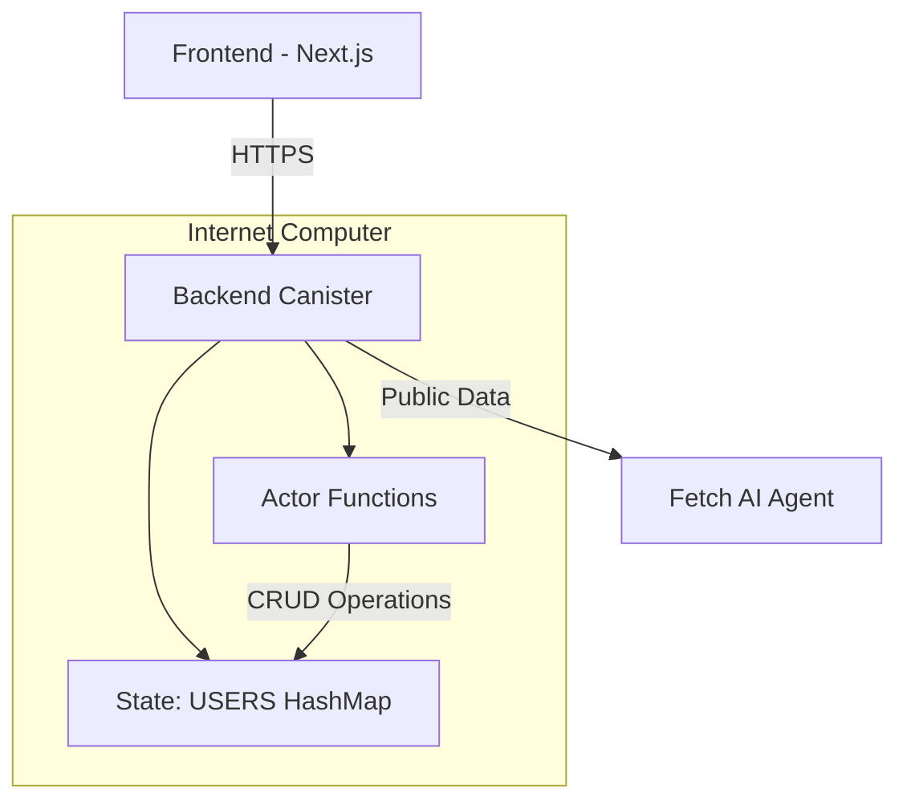
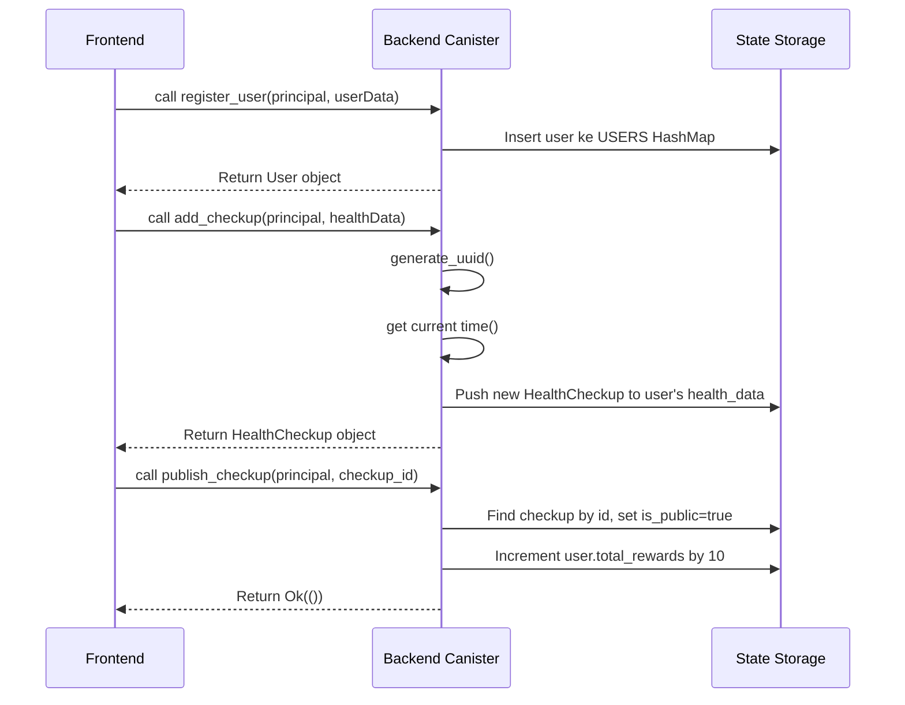

# Kerangka Kerja Pengembangan FetchAI IC Rust

Dokumentasi ini merangkum pola dan prinsip pengembangan yang digunakan dalam proyek FetchAI IC Rust, menyajikan kerangka kerja pengembangan yang konsisten untuk memastikan kualitas, keamanan, dan skalabilitas jangka panjang.

## 1. Pola Arsitektur Sistem

### Arsitektur Berlapis
```
┌─────────────────┐     ┌─────────────────────┐
│   Frontend      │     │     Backend         │
│   (Next.js)     │────▶│   (Rust/ICP)        │
└─────────────────┘     └─────────────────────┘
        │                         │
        ▼                         ▼
   UI Components           Actor Functions
   State Management        State Management
   Error Handling          Data Validation
```

### Prinsip Desain Inti
- **Actor Model**: Backend berjalan sebagai actor tunggal dengan single-threaded execution
- **Separation of Concerns**: Frontend menangani presentasi dan UX, backend menangani logika bisnis dan penyimpanan
- **Decentralized Identity**: Menggunakan Internet Identity dengan Principal ID sebagai pengenal unik
- **State Persistence Otomatis**: Memanfaatkan mekanisme persistensi ICP tanpa framework penyimpanan eksternal



## 2. Prinsip Pengembangan Frontend dan Backend

### Prinsip Backend (Rust)
1. **State Management Minimalis**
   - Gunakan `thread_local!` untuk penyimpanan state
   - Hindari framework Storable kompleks
   - Andalkan mekanisme persistensi otomatis ICP
   ```rust
   thread_local! {
       static USERS: RefCell<HashMap<Principal, User>> = RefCell::new(HashMap::new());
   }
   ```

2. **Type Safety yang Ketat**
   - Gunakan semua trait penting: `Serialize`, `Deserialize`, `CandidType`, `Clone`
   - Hindari tipe dinamis sebisa mungkin
   - Validasi data di batas sistem

3. **Error Handling Konsisten**
   - Gunakan pola `Result<T, String>` secara konsisten
   - Gunakan early return dengan `?` operator
   - Sediakan pesan error yang deskriptif

4. **Implementasi Tanpa Dependency**
   - Buat UUID secara internal tanpa dependency eksternal
   - Gunakan fungsi bawaan ICP seperti `raw_rand()` dan `time()`
   - Minimalkan dependency eksternal untuk mengurangi attack surface

### Prinsip Frontend (Next.js/React)
1. **Custom Hooks sebagai Abstraksi**
   - Semua komunikasi backend harus melalui custom hooks
   - Gunakan naming convention: `use{FeatureName}` (contoh: `useUserProfile`)
   - Enkapsulasi seluruh logika komunikasi dan error handling dalam hooks

2. **User-Centric Error Handling**
   - Sembunyikan error dari UI, tampilkan hanya kebutuhan minimal
   - Gunakan retry otomatis dengan exponential backoff
   - Berikan feedback loading yang jelas untuk operasi asinkron

3. **Type Safety End-to-End**
   - Gunakan TypeScript secara ekstensif
   - Manfaatkan file `.did.d` yang dihasilkan dari Candid
   - Definisikan interface TypeScript untuk seluruh data dari backend

4. **Performance First**
   - Gunakan `useMemo` dan `useCallback` untuk optimasi re-render
   - Minimalkan komponen wrapper yang tidak perlu
   - Fokus pada loading state dan skeleton UI

## 3. Strategi Integrasi Komponen

### Pola Komunikasi Backend-Frontend
Sistem menggunakan pola REST-like HTTP Interface dengan routing manual:

| Endpoint | Method | Handler | Deskripsi |
|---------|--------|---------|-----------|
| `/register-user` | POST | `handle_register_user` | Pendaftaran pengguna baru |
| `/add-checkup` | POST | `handle_add_checkup` | Menambah data kesehatan |
| `/publish-checkup` | POST | `handle_publish_checkup` | Publikasi data kesehatan |
| `/reward-user` | POST | `handle_reward_user` | Beri reward ke pengguna |
| `/get-profile` | POST | `handle_get_profile` | Ambil profil pengguna |
| `/get-public-data` | POST | `handle_get_public_data` | Ambil data publik |
| `/get-private-data` | POST | `handle_get_private_data` | Ambil data pribadi |
| `/get-history` | POST | `handle_get_user_history` | Ambil histori pengguna |

### Alur Integrasi yang Direkomendasikan
1. **Frontend** membuat custom hook khusus untuk setiap fitur
2. **Backend** menyediakan fungsi actor dengan parameter Principal ID
3. **Routing HTTP** ditangani oleh `http_request_update()`
4. **Handler** dipisah dari fungsi bisnis inti
5. **Respon** dikembalikan dalam format JSON standar



## 4. Pendekatan Penanganan Error dan Manajemen State

### Backend State Management
```rust
// Gunakan thread_local! untuk penyimpanan persisten
thread_local! {
    static USERS: RefCell<HashMap<Principal, User>> = RefCell::new(HashMap::new());
}

// Pattern akses konsisten
USERS.with(|users| {
    let users = users.borrow(); // Untuk query
    // atau
    let mut users = users.borrow_mut(); // Untuk update
});
```

**Aturan:**
- Tidak ada variabel global atau static kecuali untuk thread_local
- Fungsi query menggunakan `borrow()`
- Fungsi update menggunakan `borrow_mut()`
- Hanya ada satu state global utama yang menyimpan seluruh data aplikasi

### Frontend Error Handling Strategy
1. **Retry Otomatis**: Semua operasi query memiliki retry otomatis hingga 3 kali
```typescript
const maxRetries = 3;
const baseDelay = 1000; // 1 detik
// Exponential backoff: delay = baseDelay * 2^(attempt-1)
```

2. **Error Silencing**: Error yang berulang disembunyikan dari UI
3. **Specific Error Handling**: Implementasi khusus untuk BigInt dan timestamp
```typescript
// Konversi dari nanodetik ke milidetik
function convertTimestamp(timestamp: bigint | number): number {
    return Number(timestamp) / 1_000_000;
}
```

4. **User Feedback**: Gunakan loading state dan skeleton, bukan error message langsung

## 5. Pola Desain Komponen dan Reusable Code

### Architektur Komponen Frontend
```
src/
├── components/
│   ├── app-breadcrumb.tsx
│   ├── app-header.tsx
│   ├── app-sidebar.tsx
│   ├── theme-toggle.tsx
│   ├── title-content.tsx
│   └── ui/ (shadcn UI components)
├── hooks/
│   ├── service.ts
│   ├── use-auth-redirect.ts
│   ├── use-backend.ts
│   └── use-mobile.ts
├── app/
│   ├── (dashboard)/
│   ├── (landing)/
│   └── register/
└── providers/
    ├── auth-provider.tsx
    └── theme-provider.tsx
```

### Custom Hooks sebagai Standar
```typescript
// Format standar custom hook
export const useFeature = () => {
    const service = useService(CANISTER_ID);
    const [data, setData] = useState<Data | null>(null);
    const [loading, setLoading] = useState(false);
    const [error, setError] = useState<string | null>(null);

    const fetch = useCallback(async () => {
        // Implementasi dengan retry otomatis
    }, [service]);

    useEffect(() => {
        fetch();
    }, [fetch]);

    return { data, loading, error, refetch: fetch };
};
```

**Prinsip:**
- Satu hook per fungsi bisnis utama
- Enkapsulasi seluruh logika komunikasi
- Konsistensi dalam struktur return value
- Error handling terpusat dalam hook

## 6. Prinsip Keamanan dan Validasi Data

### Keamanan Backend
1. **Otorisasi Berbasis Principal**
   - Semua fungsi kritis memverifikasi kepemilikan data
   - Parameter `principal` selalu sebagai argumen pertama
   - Tidak ada fungsi yang mengakses data tanpa verifikasi Principal ID

```rust
pub fn get_user_profile(principal: Principal) -> Result<User, String> {
    USERS.with(|users| {
        let users = users.borrow();
        match users.get(&principal) {
            Some(user) => Ok(user.clone()),
            None => Err("User not found".to_string()),
        }
    })
}
```

2. **Data Integrity**
   - Validasi input di setiap boundary function
   - Gunakan tipe data yang tepat (u64 untuk timestamp, f32 untuk suhu)
   - Enforce business logic constraints

3. **Attack Surface Minimization**
   - Minimalkan fungsi update publik
   - Gunakan fungsi query untuk operasi baca
   - Hindari fungsi yang memodifikasi state tanpa verifikasi

### Validasi Data Frontend
1. **Runtime Validation**
   - Validasi timestamp dengan range checking
   - Handle BigInt dari backend secara eksplisit
   - Use `Intl.DateTimeFormat` untuk format tanggal

2. **Input Sanitization**
   - Clean input sebelum dikirim ke backend
   - Validate format data sebelum dikirim
   - Handle special characters dan SQL injection

3. **Security Headers**
   - Gunakan security headers bawaan Next.js
   - Enable CSP (Content Security Policy)
   - Use HTTPS untuk semua komunikasi

## 7. Strategi Performa dan Optimasi

### Backend Optimizations
1. **Memory Efficiency**
   - Gunakan `clone()` hanya saat diperlukan
   - Minimalisasi copy data besar
   - Gunakan streaming untuk data besar

2. **Computation Efficiency**
   - Hindari komputasi berat di fungsi update
   - Gunakan algoritma yang efisien untuk operasi koleksi
   - Optimasi query pada struktur data

3. **Network Efficiency**
   - Minimalkan payload response
   - Gunakan compression bila memungkinkan
   - Optimasi batch operations

### Frontend Optimizations
1. **React Performance**
   - Gunakan `React.memo` untuk komponen yang sering dirender
   - Gunakan `useMemo` untuk komputasi berat
   - Gunakan `useCallback` untuk functions dalam dependencies

2. **Network Optimization**
   - Implementasi exponential backoff untuk retry
   - Gunakan caching lokal untuk data yang tidak berubah cepat
   - Optimasi request batching

3. **Loading Experience**
   - Gunakan skeleton screens untuk loading
   - Implementasi optimistic updates untuk UX yang lebih cepat
   - Provide clear feedback untuk operasi asinkron

## 8. Kerangka Kerja Pengembangan yang Disarankan

Berdasarkan temuan ini, berikut adalah kerangka kerja pengembangan yang konsisten untuk proyek ini:

### Standar Pengembangan
| Aspek | Standar |
|-------|--------|
| State Management | `thread_local!` dengan `RefCell<HashMap>` |
| Error Handling | `Result<T, String>` konsisten |
| Type Safety | `Serialize`, `Deserialize`, `CandidType`, `Clone` |
| Security | Principal ID verification pada semua akses data |
| Performance | Exponential backoff, memoization, skeleton UI |

### Checklist Implementasi Baru
[ ] Gunakan custom hook untuk komunikasi backend
[ ] Implementasi retry otomatis 3x dengan backoff eksponensial
[ ] Verifikasi Principal ID pada setiap akses data
[ ] Gunakan type safety end-to-end
[ ] Validasi timestamp dan BigInt secara eksplisit
[ ] Sediakan loading state dan error handling
[ ] Dokumentasikan fungsi dengan format yang konsisten

### Best Practices
1. **Consistency First**: Pertahankan pola dan konvensi yang ada
2. **Security by Default**: Selalu verifikasi otorisasi sebelum akses data
3. **Performance Awareness**: Pertimbangkan dampak pada performa sejak awal
4. **User Experience**: Fokus pada UX yang mulus meskipun ada error
5. **Maintainability**: Buat kode yang mudah dipahami dan dimodifikasi

Dokumentasi ini menjadi panduan utama untuk semua pengembangan masa depan dalam proyek FetchAI IC Rust, memastikan konsistensi, kualitas, dan keamanan kode.